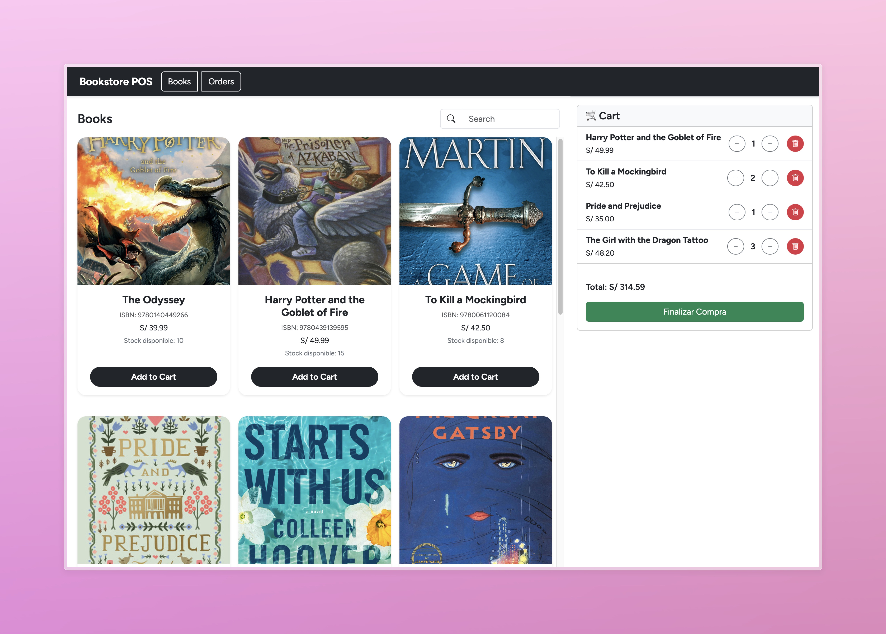
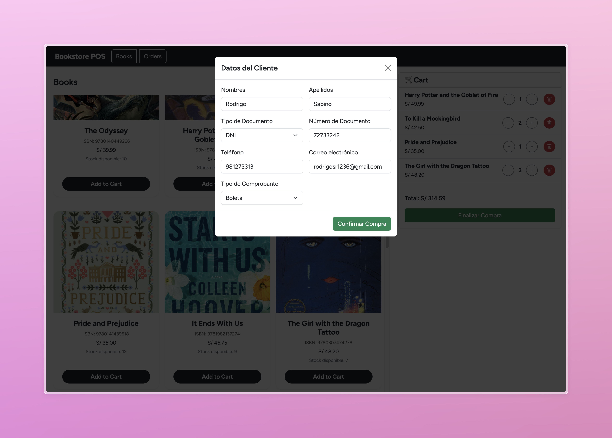
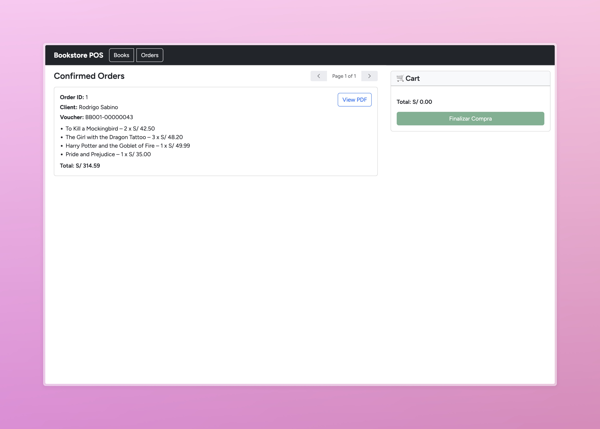
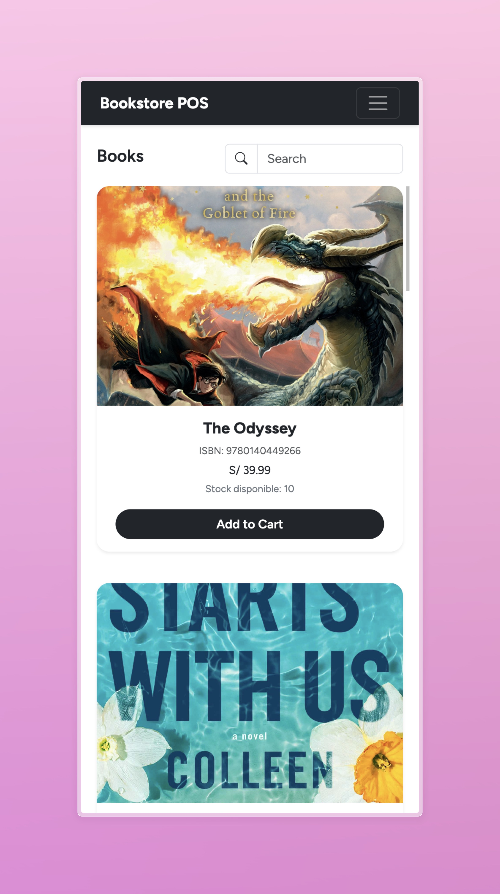
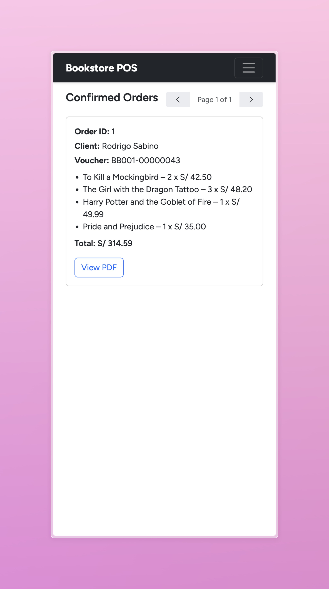

# 📚 Bookstore POS – Full Stack Challenge 2025

**Bookstore POS** es un sistema de punto de venta (POS) diseñado para gestionar la venta de libros de forma eficiente, intuitiva y visual. Esta organización contiene los repositorios separados para el **frontend** y el **backend** del sistema.

## 🧩 Repositorios

| Repositorio        | Descripción                                  |
|--------------------|----------------------------------------------|
| [`frontend-bookstore`](https://github.com/bookstore-pos/frontend-bookstore) | Aplicación web construida en Angular para gestionar el catálogo, carrito de compras y órdenes. Incluye diseño responsive y funcionalidad completa de punto de venta. |
| [`backend-bookstore`](https://github.com/bookstore-pos/backend-bookstore)   | API RESTful construida en Node.js y Express con Prisma ORM y PostgreSQL. Permite operaciones sobre libros, órdenes, clientes y comprobantes. |

## 📥 Recursos útiles

- 📄 [Script SQL con libros de muestra](profile/resources/sql/books.sql)
- 🖼 Capturas de pantalla del sistema disponibles en la carpeta `resources/images/`

---

## 📸 Capturas de Pantalla

### 💻 Vista Escritorio

### 📱 Vista Móvil

---

## 🛠 Tecnologías principales

- **Frontend:** Angular, Bootstrap
- **Backend:** Node.js, Express, Prisma, PostgreSQL
- **Otros:** Toasts, Validaciones, Modal Checkout, Imágenes reales

> Visita los README individuales de cada repositorio para detalles de instalación y ejecución.

## ✨ Características destacadas

- Gestión de libros con imágenes reales
- Carrito de compras con validación de stock
- Registro de clientes y emisión de comprobantes
- Responsive design para dispositivos móviles
- Integración con API externa de comprobantes

## 🚀 Objetivo

Este proyecto fue desarrollado como parte de una **prueba técnica Full Stack 2025** para demostrar habilidades en desarrollo frontend, backend, integración de APIs y buenas prácticas de desarrollo.

---
